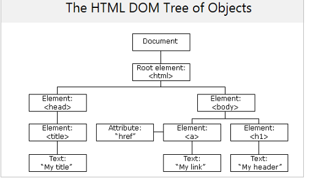
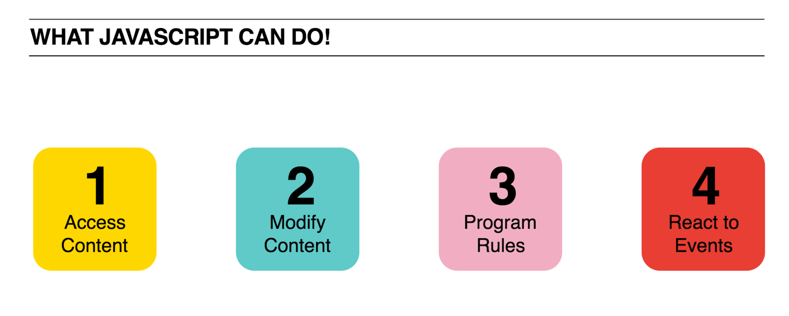

# February 3, 2018

## Things to keep in mind:
- We are here to help you and we are excited to be here.
- With that in mind, ask as many questions as you can.
- No question is off limits, no matter how silly you may think it is.
- If you're a visual learner or you need something re-explained in a different way, let us know.
- This may be new for you, but we fully believe you can learn it.
- Question the process- don't just take our word for it, ask "but why?" as many times as you want.

## Introduction to Tooling
- GitHub
- File System
- Atom
- Google Chrome
- Shortcuts:
	- Copy/Cut/Paste
	- Command + tab
	- Command + S
	- Command + R
- **Exercise**: on the About Me page can you fill in the page to display your your name and a greeting message?

## Setup Instructions
To get started, we'll need to download a copy of the project we'll be working on together. Please download today's project code and open it in Atom.

Here are the steps to get started:
* download the [project code](https://github.com/melody-curriculum/april29/archive/master.zip)
* unzip it
* open the project in "Atom" by dragging the folder onto the green "Atom" icon in your dock
* finally, open the file named `index.html` in your Chrome Browser.

## What is front-end web development?
- Everything your eyes can see on the page.
- Composed of HTML, CSS, and JavaScript.
- A front-end developer will take the work of a designer, and code it on the front-end so a back-end developer can build on top of that.

### What is HTML?
- Stands for: Hyper Text Markup Language.
- It is the content of the page.
	- e.g. header or paragraph
- Has its own default styles.

### What is CSS?
- Stands for: Cascading Style Sheet.
- It is the stylistic component of the page.
- Overrides the default styles of HTML.
	- e.g. change the color or the font-family of your header

### What is JavaScript?
- Helps increase interactivity of the page.
- Helps with page interactions such as animations.
- Helps with dynamic loading of content.


## Let's Dive Deeper
### HTML:
#### Tag
- Allow you to set up structure of the page.
- Tell the browser how to format content.
- What is the difference between a block and inline element?
- Important block elements to start you off: h1-h6, p, ul/li, hr.
		`<h1>Hello World!</h1>`
- Important inline elements to start you off: span, img, a.
		`<span> </span> `


#### Basic layout for an HTML file
```
<!DOCTYPE html>
<html>
<head>
	<meta charset="UTF-8">
	<title>My First Webpage</title>
</head>
<body>
	<h1>Hello World!</h1>
</body>
</html>
```

- **Exercise**: Chrome inspector tool
	- right click > Inspect
	- the elements tab


- Nesting: what does it mean to nest tags? What is DOM and how is it a tree?

	

- **Exercise**: can you add link(s) to your social media accounts, and customize the image?

### CSS:

- In order to run external CSS you need to link it to the HTML. This goes in the head tag:

	`<link rel=“stylesheet” href=“style.css” >`

#### Basic layout for a CSS file
- CSS rules
- How do you select an element to style it?
	```
	h1 {
		color: #FF9966;
		text-align: center;
	}

	```
- Series of key value pairs.
- Important CSS attributes to get you started: color, background-color, font-size, font-family, text-align, height, width.
- **Exercise**:  can you customize the background color, the font, and the font color?

### id versus class
#### id:
- A selector.
- They are used if you want a single, unique element.

HTML:

```
<h1 id=“header”>Welcome to my website</h1>

```
CSS: hash/pound sign designate an id

```
#header{
	text-align: center;
	color: red;
}
```


#### class:
- A selector.
- Select an element with a specific class attribute.

HTML:

```
<p class=“paragraph”>
     Here are my favorite hobbies: reading, hiking, and scuba diving.
</p>
<p class=“paragraph”>
     My favorite films are: Life is Beautiful, Life of Pi, and Lord of the Rings.
</p>

```
CSS: a period designates a class

```
.paragraph {
	color: green;
}

```
### JavaScript:
- Can someone remind us the purpose of this language?
	
- The Chrome Javascript Console: how can we use this and why?
- **Exercise**: alert('hi');
- Does someone recall which term we use to refer to all the objects on the page?
- _querySelectorAll()_: a method that returns all elements in the document that matches a specified CSS selector(s).
- A JavaScript _function_ is a block of code designed to perform a particular task.
- **Exercise**: with a partner take a look at this [Codepen](https://codepen.io/nevan/pen/shtLA) and try to read through the code as best as you can. Explain what you think is happening to one another(don't worry about syntax right now). Now try and debug together ("Slow" should turn light yellow, "Go" should turn light green).

### Lab:
- What is:
	- an emoji?
	- an image?
	- a textual character?
	- a font?
- Every character is encoded as a number- why?
- ascii vs. utf-8
- inline events
- the keyword "this" as "me" or "my"
- onchange="alert(this.value)"
- onchange="search(this.value)"
- selecting elements by tagname
- adding classes to html elements / filtering by class name
- looping using for..of

## Summary
- HTML, CSS, and JS work together.
- What do you think is happening on the back-end?
